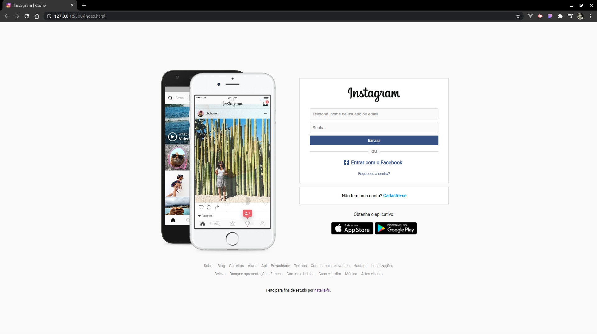
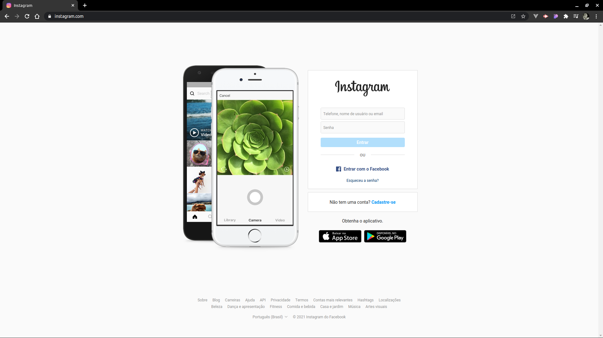

# UI Clone - Instagram Homepage

Clone da página inicial do Instagram feita com HTML e SCSS.

## Preview

    

    (Versão clone feita para entregar como projeto no Bootcamp HTML Web Developer da Digital Innovation One)

    

    (Versão original do Instagram)

